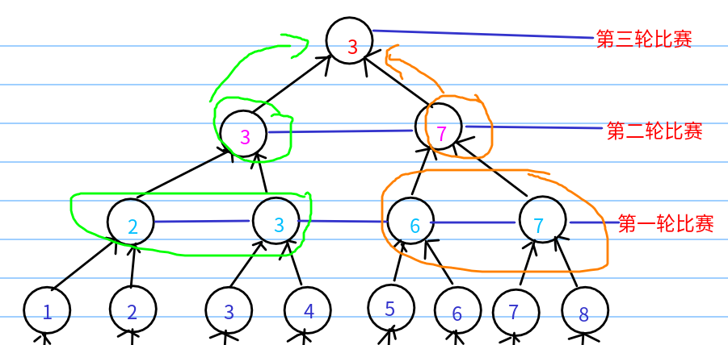
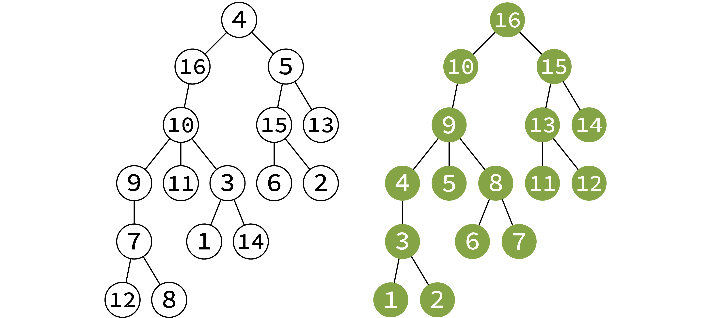
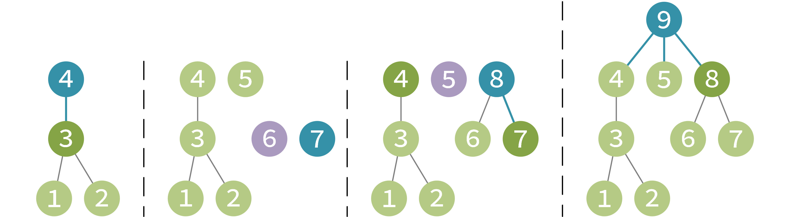

# 动态规划

<!-- more -->

初始化

## 常见模型

### 最长上升子序列模型

[导弹拦截 - 洛谷 ](https://www.luogu.com.cn/problem/P1020)

STL 二分

```cpp
// 严格上升：  >		lower_bound()
// 不严格上升：>=		upper_bound()
// 严格下降：  <     lower_bound()	greater<int>()
// 不严格下降：<=		upper_bound()	greater<int>()

vector<int> stk;
cin>>n;
for(int i=1;i<=n;i++) cin>>a[i];
for(int i=1;i<=n;i++){
    if(stk.empty()||a[i]>stk.back()) stk.push_back(a[i]);
    else *lower_bound(stk.begin(),stk.end(),a[i])=a[i];
}
cout<<stk.size();
```

手写二分

```cpp
int tt,stk[N];

cin>>n;
for(int i=1;i<=n;i++) cin>>a[i];
for(int i=1;i<=n;i++){
    if(tt==0||a[i]>stk[tt]) stk[++tt]=a[i];            // >=
    else{
        int l=1,r=tt;
        while(l<r){
            int mid=(l+r)>>1;
            if(stk[mid]>=a[i]) r=mid;                  // >
            else l=mid+1;
        }
        stk[l]=a[i];
    }
}
cout<<tt<<"\n";
```

**Dilworth 定理**（将一个序列剖成若干个单调不升子序列的最小个数等于该序列最长上升子序列的个数）。

**贪心证明：**从左到右依次枚举每个导弹。假设现在有若干个导弹拦截系统可以拦截它，那么我们肯定选择这些系统当中位置最低的那一个。如果不存在任何一个导弹拦截系统可以拦截它，那我们只能新加一个系统了。

## 背包

无特殊说明，$n$：物品数，$m$：背包体积，$f$ 数组需初始化为0。

### 01背包

#### 求最大价值

```cpp
int n,m,v[N],w[N],f[N];
/*
f[i][j]：前i个物品体积不超过j时的最大价值
不选第i个物品：f[i][j]=f[i-1][j];
选第i个物品：  f[i][j]=max(f[i-1][j-v[i]]+w[i],f[i-1][j]);
*/
cin>>n>>m;
for(int i=1;i<=n;i++) cin>>v[i]>>w[i];
for(int i=1;i<=n;i++){
    for(int j=m;j>=v[i];j--){
        f[j]=max(f[j],f[j-v[i]]+w[i]);
    }
}
cout<<f[m];
```

恰好装满：$f$ 数组初始化为负无穷，$f[0][0]=0$ 。

#### 求方案数

```cpp
int n,m,v[N],f[N];
/*
f[i][j]：前i个物品恰好装满j体积的方案数
*/
cin>>n>>m;
for(int i=1;i<=n;i++) cin>>v[i];
f[0]=1;
for(int i=1;i<=n;i++){
    for(int j=m;j>=v[i];j--){
        f[j]+=f[j-v[i]];
    }
}
cout<<f[m];
```

### 完全背包

完全背包每件物品可以选无限次

#### 求最大价值

```cpp
int n,m,v[N],w[N],f[N][N];
/*
f[i][j]：前i个物品体积不大于j的最大价值
选k个i：f[i][j]=f[i-1][j-k*v[i]]+k*w[i]
优化：f[i][j]=max(f[i-1][j],f[i][j-v[i])+w[i];
*/
cin>>n>>m;
for(int i=1;i<=n;i++) cin>>v[i]>>w[i];
for(int i=1;i<=n;i++){
    for(int j=1;j<=m;j++){
        f[i][j]=f[i-1][j];
        if(j>=v[i]) f[i][j]=max(f[i][j],f[i][j-v[i]]+w[i]);
    }
}
cout<<f[n][m];
```

#### 求方案数

$f[i][j]+=f[i][j-k*a[i]]$

注意初始化 $f[i][0]=1$

```cpp
int n,v[10]={0,10,20,50,100},f[10][11000];
/*
f[i][j]：前i个物品恰好装满j的方案数
选k个i：f[i][j]+=f[i-1][j-k*v[i]]
优化：f[i][j]=f[i-1][j]
    f[i][j]+=f[i][j-v[i]];
*/
cin>>n;
f[0]=1;
for(int i=1;i<=n;i++){
    for(int j=0;j<=n;j++){
        if(j>=v[i]) f[j]+=f[j-v[i]];
    }
}
```

### 多重背包

#### 2进制优化

```cpp
/*
先将每个物品的s个分成2进制；
然后用01背包：f[i][j] = max(f[i-1][j], f[i-1][j-v[i]]+w[i]);
*/
int cnt=0,n,m;
cin>>n>>m;
for(int i=1;i<=n;i++){
    int a,b,s,k=1;
    cin>>a>>b>>s;
    while(s>=k){
        ++cnt;
        v[cnt]=a*k;
        w[cnt]=b*k;
        s=s-k;
        k=k<<1;
    }
    if(s){
        ++cnt;
        v[cnt]=a*s;
        w[cnt]=b*s;
    }
}
for(int i=1;i<=cnt;i++){
    for(int j=m;j>=v[i];j--){
        f[j] = max(f[j], f[j-v[i]]+w[i]);
    }
}
```


### 分组背包

```cpp
int n,m,k=100;
vector<int> v[110],w[110],f(N);
/*
f[i][j]：前i组花费j价格的最大价值
f[i][j]=max(f[i-1][j],f[i-1][j-v[i][1]]+w[i][1],f[i-1][j-v[i][2]]+w[i][2]...);

f[j]=max(f[j],f[j-v[i][1]]+w[i][1],f[j-v[i][2]]+w[i][2]...);
*/

void solve(){
	cin>>m>>n;
	for(int i=1;i<=n;i++){
		int a,b,c;
		cin>>a>>b>>c;
		v[c].push_back(a);
		w[c].push_back(b);
	}
	for(int i=1;i<=k;i++){
		for(int j=m;j;j--){
			for(int q=0;q<v[i].size();q++){
				if(j>=v[i][q]) f[j]=max(f[j],f[j-v[i][q]]+w[i][q]);
			}
		}
	}
	cout<<f[m];
}
```

## 数位dp	

[数字组成的奥妙——数位dp](https://www.luogu.com.cn/article/tzeo544s)

f 数组在允许的情况下，尽可能表示出所有参数

> [**AcWing1082. 数字游戏**](https://www.acwing.com/problem/content/1084/)
>
> 科协里最近很流行数字游戏。
>
> 某人命名了一种不降数，这种数字必须满足从左到右各位数字呈非下降关系，如 $123123$，$446446$。
>
> 现在大家决定玩一个游戏，指定一个整数闭区间 $[a,b]$，问这个区间内有多少个不降数。
>
> **注意：**不降数不能包含前导零。
>
> #### 输入格式
>
> 输入包含多组测试数据。
>
> 每组数据占一行，包含两个整数 $a$ 和 $b$。
>
> #### 输出格式
>
> 每行给出一组测试数据的答案，即 $[a,b]$ 之间有多少不降数。

时间复杂度 $O(T*10*log(r))$ 。

```cpp
#include <bits/stdc++.h>
#define int long long
using namespace std;
int a[20], tt;
// f[i][j]:无限制，第i位没填数且前导数为j的情况下，有多少不降数。
int f[20][20];

// 当前是第pos位（未填数），是否是最高位：limit，前导数：pre。情况下的不降数。
int dfs(int pos, int limit, int pre) {
	if(pos == 0) return 1;
	if(!limit && f[pos][pre] != -1) return f[pos][pre];

	int maxd = limit ? a[pos] : 9;
	int res = 0;
	for(int i = 0; i <= maxd; i++) {
		if(i < pre) continue;
		if(limit && i == maxd) res += dfs(pos - 1, 1, i);
		else res += dfs(pos - 1, 0, i);
	}

	if(!limit) f[pos][pre] = res;
	return res;
}

int cal(int x) {
	tt = 0;
	while(x) {
		a[++tt] = x % 10;
		x /= 10;
	}
	return dfs(tt, 1, 0);
}

signed main() {
	ios::sync_with_stdio(false);
	cin.tie(0);
	int l, r;
	memset(f, -1, sizeof f);
	// 特判0
	while(cin >> l >> r) {
		cout << cal(r) - cal(l - 1) << "\n";
	}
	return 0;
}
```

```cpp
//如果取模的话
cout<<(cal(r)-cal(l-1)+mod)%mod;
```

> [**洛谷P2602 [ZJOI2010] 数字计数**](https://www.luogu.com.cn/problem/P2602)
>
> 给定两个正整数 $a$ 和 $b$，求在 $[a,b]$ 中的所有整数中，每个数码（digit）各出现了多少次。

```cpp
#include <bits/stdc++.h>
#define int long long
using namespace std;
int a[100], tt;
int f[15][70][70];

int dfs(int pos, int limit, int lead, int x, int sum) {
	if(pos == 0) return sum;
	if(!limit && !lead && f[x][pos][sum] != -1) return f[x][pos][sum];

	int maxd = limit ? a[pos] : 9;
	int res = 0;
	for(int i = 0; i <= maxd; i++) {
//		cout << pos << " " << i << "\n";
		if(lead && i == 0) res += dfs(pos - 1, limit && (i == maxd), 1, x, sum);
		else res += dfs(pos - 1, limit && (i == maxd), 0, x, sum + (i == x));
	}

	if(!limit && !lead) f[x][pos][sum] = res;
	return res;
}

int cal(int n, int x) {
	tt = 0;
	while(n) {
		a[++tt] = n % 10;
		n /= 10;
	}
	return dfs(tt, 1, 1, x, 0);
}

signed main() {
	ios::sync_with_stdio(false);
	cin.tie(0);
	int l, r;
	memset(f, -1, sizeof f);
	cin >> l >> r;
	for(int i = 0; i <= 9; i++) {
		cout << cal(r, i) - cal(l - 1, i) << " ";
	}
	return 0;
}
```

例题：

[Problem - 2089 (hdu.edu.cn)](https://acm.hdu.edu.cn/showproblem.php?pid=2089)

[数字计数 - 洛谷 ](https://www.luogu.com.cn/problem/P2602)

## 记忆化搜索

### 滑雪

 [此处为题面](https://www.luogu.com.cn/problem/P1434)

先想普通 $dfs$，因为没有要求起点、终点，所以每个点 $dfs$ 一次，$dfs(i , j)$ 含义是：以 $[i , j]$ 为起点的最长路径（不包含起点）。

如果 某个点 $[x , y]$ 的周围有比它小的点 $[xx , yy]$ ，说明 $[x , y]$ 可以到达 $[xx , yy]$ ，对 $[xx , yy]$ 进行$dfs$，更新 $[x , y]$的最长路径。

但是会超时，于是用记忆化优化，用 $f[i , j]$ 存下来以 $[i , j]$ 为起点的最长路径，下次搜到 $[i , j]$ 时不用继续往下搜了，直接返回 $f[i , j]$ 。

记忆化搜索每个点只会向下递归1次，所以时间复杂度是 $O(r*c)$ 。

```cpp
#include<bits/stdc++.h>
using namespace std;
int a[1010][1010], f[1010][1010];
int r, c, ma;

int dfs(int x, int y) {
    if (f[x][y]) return f[x][y];         //记忆化
    else {
        int dx[4] = { -1,0,1,0 }, dy[4] = { 0,1,0,-1 };
        for (int i = 0; i < 4; i++) {
            int xx = x + dx[i], yy = y + dy[i];
            //如果在范围内且比当前位置低，就递归
            if (xx > 0 && xx <= r && yy > 0 && yy <= c && a[xx][yy] < a[x][y]) {
                f[x][y] = max(f[x][y], dfs(xx,yy) + 1);
            }
        }
    }
    return f[x][y];
}

int main() {
    cin >> r >> c;
    for (int i = 1; i <= r; i++) {
        for (int j = 1; j <= c; j++) {
            cin >> a[i][j];
        }
    }
    for (int i = 1; i <= r; i++) {
        for (int j = 1; j <= c; j++) {
            ma = max(ma, dfs(i, j));
        }
    }
    cout << ma + 1;
    return 0;
}
```

- [聊聊动态规划与记忆化搜索](https://www.luogu.com.cn/article/qay8mori)

## 区间dp

注意 $len=2$ 的时候， $f[i+1][j-1]$可能无意义

```cpp
//初始化
for(int len=2;len<=n;len++){
    for(int i=1,j=i+len-1;j<=2*n;i++,j++){
        for(int k=1;k<=len-2;k++){
            f[i][j]=max(f[i][j],f[i][i+k]+f[i+k][j]+a[i]*a[i+k]*a[j]);
        }
    }
}
```

## 概率/期望 dp



```cpp
//判断 x、y 第 k 轮是否可能交手
bool check(int x, int y, int k) {
    return (((x - 1) / (1 << k)) == ((y - 1) / (1 << k))) && ((x - 1) / (1 << (k - 1)) != ((y - 1) / (1 << (k - 1))));
}
```

```cpp
// 第 k 轮 x 是第几组
int cal(int x, int k) {
    return (x - 1) / (1 << (k - 1)) + 1;
}    
```

## 树形dp

### 换根dp

换根DP能解决**不指定根结点**，并且**根节点的变化**会对**一些值产生影响**的问题。例如子结点深度和、点权和等。

$up$ ：向上走的最大距离。

$dn1$ ：向下走的最大距离。

$dn2$ ：向下走的次大距离（不走 $dn1$ 的最大距离）。

```cpp
vector<pair<int,int>> g[N];
int n,mi=0x3f3f3f3f,up[N],dn1[N],dn2[N];

void dfs1(int u,int fa){
    for(auto i:g[u]){
        int f=i.first,s=i.second;
        if(f==fa) continue;
        dfs1(f,u);
        if(dn1[f]+s>=dn1[u]){
            dn2[u]=dn1[u];
            dn1[u]=dn1[f]+s;
        }
        else{
            dn2[u]=max(dn2[u],dn1[f]+s);
        }
    }
}

void dfs2(int u,int fa){
    for(auto i:g[u]){
        int f=i.first,s=i.second;
        if(f==fa) continue;
        if(dn1[u]==dn1[f]+s){
            up[f]=max(up[u]+s,dn2[u]+s);
        }
        else{
            up[f]=max(up[u]+s,dn1[u]+s);
        }
        dfs2(f,u);
    }
}
```

### dfs序

解决树形背包问题。

**问题描述**

什么是树形背包？简单的说就是在一棵有 $N$ 个节点的树上，每个节点都相当于一件物品，每件物品都有一个价格和一个得分对于物品 $a$ ，设其父节点为 $father[a]$，那么你必须购买了 $father[a]$ 后才能购买 $a$ 。现给你 $M$ 元现金，要求求一个购买方案，使得物品的总得分最大。

**分析**

我们把原树叫做 A。

定义：多叉树的**后序遍历**指的是：在搜索某个结点的过程中，先记录它的所有子树，再记录它本身。注意，如果有多个子树，则后序遍历的顺序不限。

定义：多叉树的**后序遍历序列**指的是在上述过程中所记录下来的序列。

我们不妨在 DFS 后把结点按照后序遍历序列**重新编号**。下图就是一个例子，左图为原树 A，右图为重新编号的树 B。



现在，如果我们要复制一棵树 B（不妨称复制品为 C），将新树 B 里面的结点**按编号**（也就是按照 A 树的后序遍历序列）**依次**加入 C 中，我们会发现，**每次加入的结点在当前情况下都是根结点**。下图展示了放入 4, 7, 8, 9 号结点时，新图的情况。



因此，设 ${dp}(i, j)$ 表示将树 B 的结点 $1 \ldots i$ 放入新图，背包容量为 $j$ 时，所能取得的最大价值。设 $size_i$ 表示以 $i$ 为根的子树的大小。
- 若取物品 $i$（前提是此时的背包容量放得下物品 $i$ ），则可以取它的子树，则

  - 问题转化为「将结点 $1 \ldots i-1$ 加入 $C$ ，且背包容量为 $j-1$ 时，所能取到的最大价值」加上物品 $i$ 的价值，

  - 所以答案为 ${dp}(i-1, j-1)+v_i$ ；

- 若不取物品 $i$ ，则不可以取它的子树，则

  - 问题转化为「将『结点 $1 \ldots i-1$ 中不属于 $i$ 的子树的结点』加入 $C$ ，背包容量不变时，所能取到的最大价值」

  - 答案为 ${dp}\left(i-{size}_i, j\right)$ ；


综上可得 $\operatorname{dp}(i, j)=\left\{\begin{array}{ll}\max \left(\operatorname{dp}(i-1, j-1)+v_i, \operatorname{dp}\left(i-\operatorname{size}_i, j\right)\right) & j \geq w_i \\ \operatorname{dp}\left(i-\operatorname{size}_i, j\right) & j<w_i\end{array}\right.$ 。易证其时间复杂度为 $O(N M)$ 。

```cpp
int Size[500], id[500], cnt;

void dfs(int u) {
    Size[u] = 1;
    for (int i : g[u]) {
        dfs(i);
        Size[u] += Size[i];
    }
    id[++cnt] = u;
}
dfs(0);
for (int i = 1; i <= n + 1; i++) {
    for (int j = 1; j <= m + 1; j++) {
        f[i][j] = max(f[i - 1][j - 1] + s[id[i]], f[i - Size[id[i]]][j]);
    }
}
```

## 状压dp

```cpp
#include <bits/stdc++.h>
#define int long long
using namespace std;
const int N = 200010;
int n, k;

bool check(int x) {
    return !(x & (x >> 1));
}

int count(int x) {
    return __builtin_popcount(x);
}

/*
f[i][j][state]: 前i行，总共用j个棋子，第i行是state的方案数
f[i][j][state]+=f[i-1][j-count(state)][pre[state]];
*/
vector<int> state;
vector<int> pre[N];
int f[12][120][2000];
void solve() {
    cin >> n >> k;
    for (int i = 0; i < (1 << n); i++) {
        if (check(i)) state.push_back(i);
    }
    for (int i : state) {
        for (int j : state) {
            if (!(i & j) && (check(i | j))) pre[i].push_back(j);
        }
    }
    f[0][0][0] = 1;
    for (int i = 1; i <= n + 1; i++) {
        for (int j = 0; j <= k; j++) {
            for (int u : state) {
                for (int v : pre[u]) {
                    if (j - count(u) >= 0) {
                        f[i][j][u] += f[i - 1][j - count(u)][v];
                        // cout << i << " " << j << " " << u << " " << v << " " << f[i][j][u] << "\n";
                    }
                }
            }
        }
    }
    cout << f[n + 1][k][0];
}

signed main() {
    ios::sync_with_stdio(false);
    cin.tie(0);
    int T = 1;
    // cin >> T;
    while (T--) {
        solve();
    }
    return 0;
}
```

蒙德里安的梦想

```cpp
#include <bits/stdc++.h>
#define int long long
using namespace std;
const int N = 200010;
int n, m;

bool check(int x, int m) {
    bitset<12>b(x);
    for (int i = 0; i < m - 1; i++) {
        if (!b[i]) {
            if (!b[i + 1]) b[i] = b[i + 1] = 1;
            else return false;
        }
    }
    return b[m - 1];
}

void solve() {
    while (cin >> n >> m && n && m) {
        vector<vector<int>> f(n + 3, vector<int>((1 << m) + 3));
        vector<int> st((1 << m) + 3);
        vector<int> pre[(1 << m) + 3];
        for (int i = 0; i < (1 << m); i++) if (check(i, m)) st[i] = 1;
        for (int i = 0; i < (1 << m); i++) {
            for (int j = 0; j < (1 << m); j++) {
                if (st[i | j] && ((i & j) == 0)) pre[j].push_back(i);
            }
        }
        f[0][0] = 1;
        for (int i = 1; i <= n; i++) {
            for (int u = 0; u < (1 << m); u++) {
                for (int v : pre[u]) {
                    f[i][u] += f[i - 1][v];
                    // cout << i << " " << v << " " << u << " " << f[i - 1][v] << "->" << f[i][u] << "++\n";
                }
            }
        }
        cout << f[n][0] << "\n";
    }
}

signed main() {
    ios::sync_with_stdio(false);
    cin.tie(0);
    int T = 1;
    // cin >> T;
    while (T--) {
        solve();
    }
    return 0;
}
```

## 状态回溯

https://ac.nowcoder.com/acm/contest/101921/E

```cpp
// 完全背包
// f[i][j]: i ~ n 的物品中，和为 j 的可能性
int g = k, ans = 0;
for (int i = 1; i <= n; i++) {
    while (g - a[i] >= 0 && f[i][g - a[i]]) {
        g -= a[i];
        ans++;
    }
    cout << i + ans << " ";
}
```

