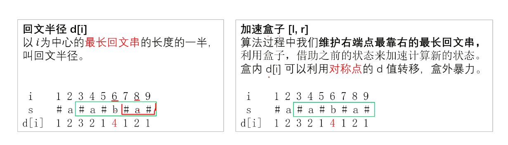
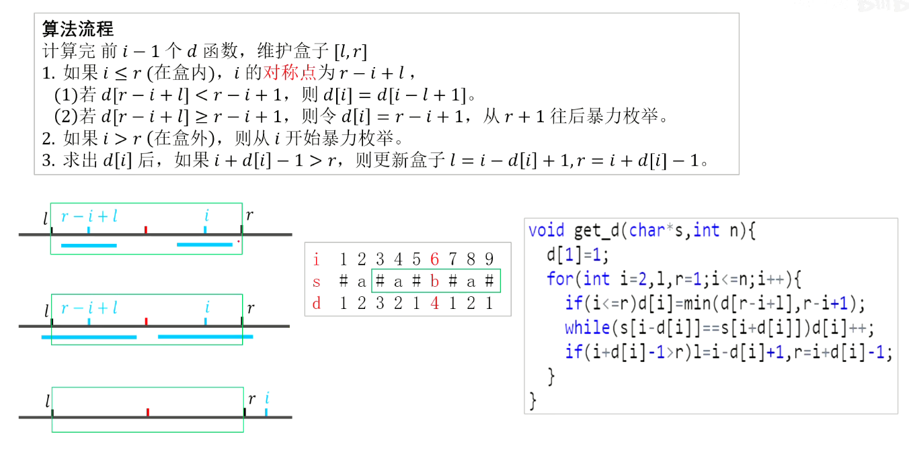

[TOC]

# 字符串

<!-- more -->

## 输入

### scanf

`scanf` 读字符时会读入空格、换行

`scanf` 读字符串时不会读入空格、换行

```cpp
char c,cc;
int x;
cin>>x>>c>>cc;
scanf("%d%c%c",&x,&c,&cc);
cout<<c<<" "<<cc;
```

**输入**

```cpp
1
2
```

**输出**

```cpp

2
```

### cin

`cin` 不会读入开始的换行、空格，遇到空格、换行停止

```cpp
//char s[1000];
//char s;
string s;
cin>>s;
```

### getchar()

`getchar` 会读入换行和空格，但是不能与IOS同时使用。

```cpp
char c=getchar();
```

### ignore()

从输入流中移除（忽略）下一个字符

如果计数值达到 $a$ 或者被抛弃的字符是 $ch$ ，则 `cin.ignore()` 函数执行终止；否则，它继续等待。

```cpp
cin.ignore();
cin.ignore(a,ch)
```

### getline()

读入一行字符串，遇到换行停止。使用前一般先清除缓存区换行符。

```cpp
string s;
getline(cin,s);
```

**清除缓存区换行方法：**

```cpp
cin.ignore();
getchar();      //不能与IOS同时使用。
getline(cin,s);
```

### stringstream

`stringstream` 可以逐个读取单词（或更准确地说，是由空白字符分隔的字符串序列）。

```cpp
string s;
getline(cin,s);
stringstream ss(s);   //将ss初始化为s
string str;
while(ss>>str){       //逐个读取单词，读取到str中
    cout<<str<<"\n";
}
```

## 输出

```cppp
八进制: %o
十六进制: %x
```

## string

[c++中的string常用函数用法总结_c++string函数-CSDN博客](https://blog.csdn.net/fdqw_sph/article/details/54233971)

```cpp
 string s(num,c) //生成一个字符串，包含num个c字符
 string s(str,\stridx,\strlen) //将字符串str内“始于stridx且长度顶多strlen”的部分作为字符串的初值
```

### 插入/删除字符 (串)

`insert (index, count, ch)` 和 `insert (index, str)` 是比较常见的插入函数。它们分别表示在 `index` 处连续插入 ``count`` 次字符串 $ch$ 和插入字符串 $str$ 。时间复杂度 $O(|s|-index+count)$ 。

`erase(index, count)` 函数将字符串 `index` 位置开始 (含) 的 `count` 个字符删除（若不传参给 `count` 则表示删去 `index` 位置及以后的所有字符）。

### substr

```cpp
string substr (size_t pos = 0, size_t len = npos) const;
```

## 字符串整数互换

```cpp
std::string str = "123";
int num;
num = std::stoi(str)   // string -> int
num = std::stoll(str)   // string -> long long
```

```cpp
char str[] = "456";
int num = std::atoi(str);   // char -> int
```

```cpp
int num = 123;
std::string str = to_string(num); // int -> string
```

## manacher





```cpp
int get_d(string str) {
    string s = "@#";
    for (char c : str) s += c, s += '#';
    s += '$';

    int l = 0, r = 0, n = s.size();
    vector<int> d(n);
    for (int i = 1; i <= n - 2; i++) {
        if (i <= r) d[i] = min(d[l + r - i], r - i + 1);
        while (s[i - d[i]] == s[i + d[i]]) d[i]++;
        if (i + d[i] - 1 > r) l = i - d[i] + 1, r = i + d[i] - 1;
    }

    return *max_element(d.begin(), d.end()) - 1;
}
```

## `<ctype.h>` 库

返回值为 `int` 。

```
isalpha(int c): 检查c是否为字母。
isdigit(int c): 检查c是否为数字。
isalnum(int c): 检查c是否为字母或数字。
isupper(int c): 检查c是否为大写字母。
islower(int c): 检查c是否为小写字母。
```

```
tolower(int c): 将大写字母c转换为小写字母。
toupper(int c): 将小写字母c转换为大写字母。
```

