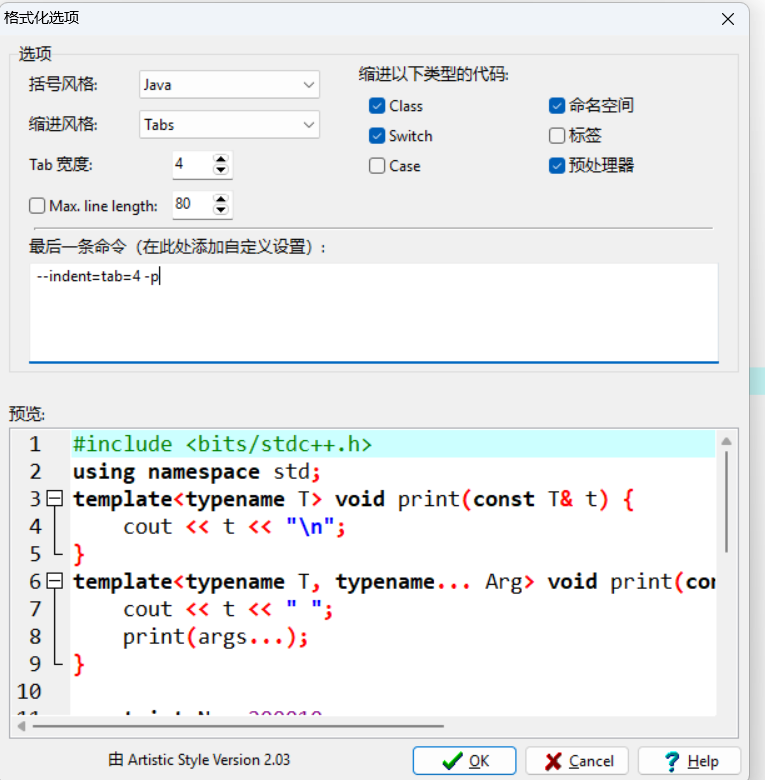

[TOC]

# 技巧

<!-- more -->

## 改变字体大小、颜色

<span style='color:文字颜色;background:背景颜色;font-size:文字大小;font-family:字体;'>文字</span>

<span style='color:文字颜色;background:背景颜色;font-size:文字大小;font-family:宋体;'>文字</span>

## 快捷键

ctrl+k：添加超链接

```cpp
      _______
     //  ||\ \
 ___//___||_\ \___
 )  _          _    \
 |_/ \________/ \___|
___\_/________\_/______
```

[在线LaTeX公式编辑器-编辑器 (latexlive.com)](https://www.latexlive.com/##)

## 其他

```cpp
// vector不能用memset()
vector<vector<int>> a(n+3,vector<int>(m+3));
vector<vector<vector<int>>> a(n+3,vector<vector<int>>(m+3,vector<int>(h+3)));
auto check=[&](int x){
    int pre=0;
    for(int i=1;i<=n;i++){
        for(int j=1;j<=m;j++){
            if(a[i][j]<=x){
                if(j<pre) return 0;
                pre=j;
            }
        }
    }
    return 1;
};
```

```cpp
vector<array<int,3>> que;
for(auto &[a,b,c]:que) cin>>a>>b>>c;
```

## 快读 / 快写

关ios

```cpp
inline int read() {
	int x = 0, f = 1;
	char ch = getchar();
	while(ch < '0' || ch > '9') {
		if(ch == '-')
			f = -1;
		ch = getchar();
	}
	while(ch >= '0' && ch <= '9')
		x = x * 10 + ch - '0', ch = getchar();
	return x * f;
}

void write(int x) {
	if(x < 0)
		putchar('-'), x = -x;
	if(x > 9)
		write(x / 10);
	putchar(x % 10 + '0');
	return;
}
```

```cpp
char* p1, * p2, buf[100000];
#define nc() (p1==p2 && (p2=(p1=buf)+fread(buf,1,100000,stdin),p1==p2)?EOF:*p1++)
int read() {
    int x = 0, f = 1;
    char ch = nc();
    while (ch < 48 || ch>57) {
        if (ch == '-')
            f = -1;
        ch = nc();
    }
    while (ch >= 48 && ch <= 57)
        x = x * 10 + ch - 48, ch = nc();
    return x * f;
}
```

## 代码片段

```cpp
"i++,1,n": {
    "prefix": "for",
    "body": "for (${1:int} ${2:i} = ${3:1}; ${2:i} <= ${4:n}; ${2:i}++)${0:}",
    "description": "i,1,n"
},
"i--, n, 1": {
    "prefix": "for",
    "body": [
        "for (${1:int} ${2:i} = ${3:n}; ${2:i} >= ${4:1}; ${2:i}--)${0:}"
    ],
    "description": "i,n,1"
},
```

```cpp
template<typename T>
void print(const T& t) {
    cout << t << "\n";
}

template<typename T, typename... Arg>
void print(const T& t, const Arg&... args) {
    cout << t << " ";
    print(args...);
}
```

## dev


