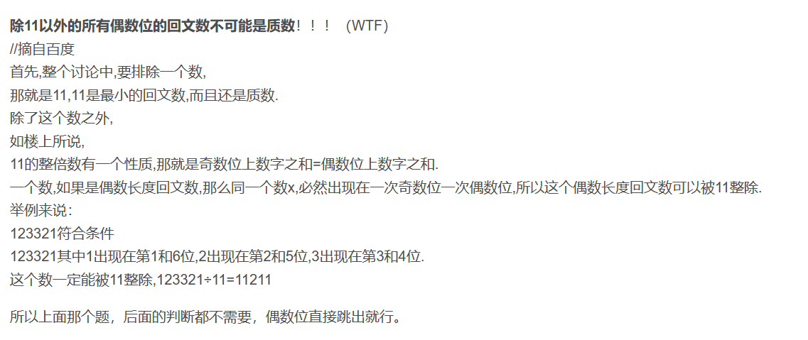

# 数论

<!-- more -->

## 卡特兰数

### 定义

卡特兰数是一个在组合数学里经常出现的一个数列，它并没有一个具体的意义，却是一个十分常见的数学规律

对卡特兰数的初步理解：有一些操作，这些操作有着一定的限制，如一种操作数不能超过另外一种操作数，或者两种操作不能有交集等，这些操作的合法操作顺序的数量

卡特兰数的前几项为 $ 1,1,2,5,14,42,132,429,1430,4862… $

**递归定义**

$f_n=f_0∗f_{n−1}+f_1∗f_{n−2}+…+f_{n−1}*f_0$，其中 $n≥2$  。

**递推关系**

$f_n=\frac{4n−2}{n+1}f_{n−1}$

**通项公式**

$f_n=\frac{1}{n+1}C^n_{2n}$

经化简后可得

$f_n=C^n_{2n}−C^{n−1}_{2n}$

只要我们在解决问题时得到了上面的一个关系，那么你就已经解决了这个问题，因为他们都是卡特兰数列

### 例题

假设非法序列为 A，对应的序列为 B。每个 A 只有一个"**第一个前缀和小于 0 的前缀**"，所以每个 A 只能产生一个 B。而每个 B 想要还原到 A，就需要找到"**第一个前缀和大于 0 的前缀**"，显然 B 也只能产生一个 A。


每个 $\mathrm{B}$ 都有 $\mathrm{n}+1$ 个 $+1$ 以及 $\mathrm{n}-1$ 个 $-1$ ，因此 $\mathrm{B}$ 的数量为 $C_{2 n}^{n+1}$ ，相当于在长度为 $2 \mathrm{n}$ 的序列中找到 $n+1$ 个位置存放 $+1$ 。相应的，非法序列的数量也就等于 $C_{2 n}^{n+1}$ 。

出栈序列的总数量共有 $C_{2 n}^n$ ，因此，合法的出栈序列的数量为 $C_{2 n}^n-C_{2 n}^{n+1}=\frac{C_{2 n}^n}{n+1}$ 。
此时我们就得到了卡特兰数的通项 $\frac{C_{2 n}^n}{n+1}$ ，至于具体如何计算结果将会在后面进行介绍。

## 斐波那契数列

$F_0 = 0$

$F_1 = 1$

$F_2=1$

$F_n = F_{n-1}+F_{n-2}$

- 由[皮亚诺定理](https://www.cnblogs.com/cjoierShiina-Mashiro/p/11385287.html) 可知，模数为 $k$ 的循环节长度不会超过 $6k$ 。皮萨诺周期是指斐波那契数列模 $k$ 时，序列开始重复的最小正整数 $m$ 。$gcd(F_n,F_m)=F_{gcd(n,m)}$ ，如果 $F_i$ 能被 $k$ 整除，那么对于每一个 $j$ ， $F_{i⋅j}$ 也能被 $k$ 整除。

- [齐肯多夫定理](https://baike.baidu.com/item/%E9%BD%90%E8%82%AF%E5%A4%9A%E5%A4%AB%E5%AE%9A%E7%90%86/7612155) ：任何正整数都可以表示成若干个不连续的斐波那契数（不包括第一个斐波那契数）之和。

  对于任何正整数，其齐肯多夫表述法都可以由贪心算法（即每次选出最大可能的斐波那契数）得到。

## 质数

- 前 $n$ 个数里面的质数的个数为 $\frac{n}{ln(n)}$ 。

* 相邻的两个正整数 一定互质

* 若 $x$ 和 $y$ 互质，那么 $x+y\ (或x-y)$ 和 $x$ 互质，且 $x+y$ 与 $x^n$ 互质 。

* 除了 $11$ 以外的所有的偶数位回文数都不是素数

* 除了 $2$ 和 $3$ 外，其余质数都与 $6$ 的倍数相邻，这些素数都满足 $6n±1$ 。

  

### 筛法

时间复杂度 $0(nlogl)$

```cpp
vector<int> primes;
void get(int n) {
    vector<int> st(n + 10);
    for (int i = 2; i <= n; i++) {
        if (!st[i]) {
            primes.push_back(i);
            for (int j = i + i; j <= n; j += i) st[j] = 1;
        }
    }
}
```

```cpp
int primes[N];
bool st[N];
int cnt;
//埃氏筛
//用质数去筛掉合数
void get_primes1(int n){
    for(int i=2;i<=n;i++){
        if(!st[i]){
            primes[++cnt]=i;
            for(int j=i+i;j<=n;j=j+i){
                st[j]=1;
            }
        }
    }
}
```

```cpp
int primes[N], isprime[N];
bool st[N];
int cnt;
//线性筛
void get_primes2(int n) {
    for (int i = 2;i <= n;i++) {
        if (!st[i]) primes[++cnt] = i, isprime[i] = 1;
        for (int j = 1;primes[j] * i <= n;j++) { //n趋于int_max时，用primes[j]<=n/i;
            st[primes[j] * i] = 1;     //不管i%primes[j]等不等于0，primes[j]都是primes[j]*i的最小质因子。
            if (i % primes[j] == 0) break;
        }
    }
}
```

## get()

```cpp
int get(int n, int p) {
    int ans = 0;
    while (n) {
        n /= p;
        ans += n;
    }
    return ans;
}
```

要计算 $n!$ 中素数 $p$ 的幂次，可以使用以下公式：

$$
\text { ans }=\left\lfloor\frac{n}{p}\right\rfloor+\left\lfloor\frac{n}{p^2}\right\rfloor+\left\lfloor\frac{n}{p^3}\right\rfloor+\cdots
$$


这个公式基于以下事实：
- $n!$ 中能被 $p$ 整除的数有 $\left\lfloor\frac{n}{p}\right\rfloor$ 个。
- $n$ ！中能被 $p^2$ 整除的数有 $\left\lfloor\frac{n}{p^2}\right\rfloor$ 个。
- $n$ ！中能被 $p^3$ 整除的数有 $\left\lfloor\frac{n}{p^3}\right\rfloor$ 个。
- 以此类推，直到 $p^k>n$ 。

因此，将所有这些贡献加起来，就得到了 $n!$ 中素数 $p$ 的幂次。

### Meissel_Lehmer

求 $[1,n]$ 内质数的个数。时间复杂度 $O(\sqrt{n})$ 。

```cpp
using i64 = long long;
#define div(a, b) (1.0 * (a) / (b))
#define half(x) (((x) - 1) / 2)
i64 Meissel_Lehmer(i64 n) {
    if (n <= 3) {
        return max(n - 1, 0LL);
    }
    long long v = sqrtl(n);
    int s = (v + 1) / 2;
    vector<int> smalls(s), roughs(s);
    vector<i64> larges(s);
    for (int i = 0 ; i < s ; i++) {
        smalls[i] = i;
    }
    for (int i = 0 ; i < s ; i++) {
        roughs[i] = i * 2 + 1;
    }
    for (int i = 0 ; i < s ; i++) {
        larges[i] = half(n / roughs[i]);
    }
    vector<bool> skip(v + 1);
    int pc = 0;
    for (int p = 3 ; p <= v ; p += 2) {
        if (skip[p] == false) {
            i64 q = p * p;
            if (q * q > n) {
                break;
            }
            skip[p] = true;
            for (int i = q ; i <= v ; i += 2 * p) {
                skip[i] = true;
            }
            int ns = 0;
            for (int k = 0 ; k < s ; k++) {
                int i = roughs[k];
                if (skip[i]) {
                    continue;
                }
                long long d = 1LL * i * p;
                larges[ns] = larges[k] - (d <= v ? larges[smalls[d >> 1] - pc] : smalls[half(div(n, d))]) + pc;
                roughs[ns++] = i;
            }
            s = ns;
            for (int i = half(v), j = (((v / p) - 1) | 1) ; j >= p ; j -= 2) {
                int c = smalls[j / 2] - pc;
                for (int e = j * p / 2 ; i >= e ; i--) {
                    smalls[i] -= c;
                }
            }
            pc++;
        }
    }
    larges[0] += 1LL * (s + 2 * (pc - 1)) * (s - 1) >> 1;
    for (int k = 1 ; k < s ; k++) {
        larges[0] -= larges[k];
    }
    for (int L = 1 ; L < s ; L++) {
        int q = roughs[L];
        long long m = n / q;
        int e = smalls[half(m / q)] - pc;
        if (e < L + 1) {
            break;
        }
        long long t = 0;
        for (int k = L + 1 ; k <= e ; k++) {
            t += smalls[half(div(m, roughs[k]))];
        }
        larges[0] += t - 1LL * (e - L) * (pc + L - 1);
    }
    return larges[0] + 1;
}
#undef div
#undef half
```

```cpp
using i64 = long long;
#define div(a, b) (1.0 * (a) / (b))
#define half(x) (((x) - 1) / 2)
i64 Meissel_Lehmer(i64 n) {
    if (n <= 3) {
        return max(n - 1, 0LL);
    }
    i64 v = sqrtl(n);
    int s = (v + 1) / 2;
    vector<int> small(s), r(s);
    vector<i64> l(s);
    for (int i = 0; i < s; i++) {
        small[i] = i;
    }
    for (int i = 0; i < s; i++) {
        r[i] = i * 2 + 1;
    }
    for (int i = 0; i < s; i++) {
        l[i] = half(n / r[i]);
    }
    vector<bool> skip(v + 1);
    int pc = 0;
    for (int p = 3; p <= v; p += 2) {
        if (skip[p] == false) {
            i64 q = p * p;
            if (q * q > n) {
                break;
            }
            skip[p] = true;
            for (int i = q; i <= v; i += 2 * p) {
                skip[i] = true;
            }
            int ns = 0;
            for (int k = 0; k < s; k++) {
                int i = r[k];
                if (skip[i]) {
                    continue;
                }
                i64 d = 1LL * i * p;
                l[ns] = l[k] - (d <= v ? l[small[d >> 1] - pc] : small[half(div(n, d))]) + pc;
                r[ns++] = i;
            }
            s = ns;
            for (int i = half(v), j = (((v / p) - 1) | 1); j >= p; j -= 2) {
                int c = small[j / 2] - pc;
                for (int e = j * p / 2; i >= e; i--) {
                    small[i] -= c;
                }
            }
            pc++;
        }
    }
    l[0] += 1LL * (s + 2 * (pc - 1)) * (s - 1) >> 1;
    for (int k = 1; k < s; k++) {
        l[0] -= l[k];
    }
    for (int L = 1; L < s; L++) {
        int q = r[L];
        i64 m = n / q;
        int e = small[half(m / q)] - pc;
        if (e < L + 1) {
            break;
        }
        i64 t = 0;
        for (int k = L + 1; k <= e; k++) {
            t += small[half(div(m, r[k]))];
        }
        l[0] += t - 1LL * (e - L) * (pc + L - 1);
    }
    return l[0] + 1;
}
#undef div
#undef half
```

## 约数

### 求约数个数

#### 分解质因数

时间复杂度最坏 $O(\sqrt{N}\ )$ 。对于合数要快于 $O(\sqrt{N} \ )$ 。

```cpp
vector<int> cal(int x) {
    vector<int> v;
    for (int i = 2; i <= x / i; i++) {
        while (x % i == 0) v.push_back(i), x = x / i;
    }
    if (x > 1) v.push_back(x);
    return v;
}
```

可以先预处理 $[1,\sqrt {n}\ ]$  的质数，然后遍历这些质数，时间复杂度约 $O(\sqrt{N} / 10)$ 。

```cpp
vector<int> get(int n) {
    vector<int> st(n + 10), primes;
    for (int i = 2; i <= n; i++) {
        if (!st[i]) {
            primes.push_back(i);
            for (int j = i + i; j <= n; j += i) st[j] = 1;
        }
    }
    return primes;
}

vector<int> cal(int x) {
    vector<int> v;
    for (int i : primes) {
        while (x % i == 0) v.push_back(i), x = x / i;
    }
    if (x > 1) v.push_back(x);
    return v;
}

```

#### 筛法

时间复杂度 $O(N\log_2N)$ 。适用于求 $[1,n]$ 每个数的约束个数。

```cpp
for(int i=1;i<=n;i++){
    for(int j=i;j<=n;j+=i) f[j]++;
}
```

## 回文数

### 判断回文数

```cpp
bool ispal(string& s){
    int n = s.size() - 1;
    for(int i=0;i<=n/2;i++) if(s[i]!=s[n-i]) return false;
    return true;
}
```

### 第n个回文数

构造第 $n$ 个正回文数，时间复杂度 $(log\ n)$ 。

长度为 $1$ 时，有 $9$ 种构造方式 $(1到9)$ ；长度为 $2$ 时，有 $9$ 种构造方式（只考虑回文串的前半段，且没有前导 $0$ ）；长度为 $3$ 时，构造回文串的前两个位，第一位有 $9$ 种选择 $(1到9)$ ，第二位有 $10$ 种 $(0到9)$ …… 长度为6时，构造前三位，第一位有九种选择，第二位有十种选择，第三位有十种选择。

我们发现，若一个 $cnt$ 位的回文串，我们需要构造出前 $(cnt+1)/ 2$ 位，共有 $9*10^{((cnt+1)/2-1)}$ 种不同的回文串（第一位是 $9$ 种选择，其他位都是 $10$ 种选择）。这样我们就能知道第 $n$ 小的回文数是由几位数构成的了。

```cpp
void get_palindromes(long long n, char s[]) {
	long long cnt = 1, ans = 9;
	while (n >= ans) {
		n -= ans;
		cnt++;
		ans = 9 * pow(10LL, (cnt + 1) / 2 - 1);
	}
	n--;
	for (int i = (cnt + 1) / 2; i >= 1; i--) {
		s[i] = n % 10 + '0';
		n /= 10;
	}
	s[1] += 1;
	for (int i = cnt; i > (cnt + 1) / 2; i--) s[i] = s[cnt - i + 1];
}
cout << s + 1 << "\n";
//注意传字符串s前，应先初始化s。
```

### next回文数

返回大于 $str$ 的最小回文数（即 $str$ 的下一个回文数），时间复杂度 $O(|str|)$ 。

对于一个形如 $\rm{ABCDEFGH}$  的整数，
有且仅有一个比它大的最小回文数，
有且仅有一个比它小的最大回文数，
而整数 $\rm{ABCDDCBA}$ 一定是其中之一。

输入一个整数 $\rm{ABCD}$ ，若整数 $\rm{ABBA}$ 比 $\rm{ABCD}$ 大，则 $\rm{ABBA}$ 就是比它大的最小回文数，然后就可以直接输出这个答案了。

而如果 $\rm{ABBA}$ 比 $\rm{ABCD}$ 要小（或等于）那我们就要找到比 $\rm{ABBA}$ 大的下一个回文数。
不难发现它就是：$\rm{ACCA}$ 且 $\rm{C=B+1}$。

```cpp
string get_next_palindromes(string& str) {
	int tt = str.size() - 1;
	while (tt >= 0 && str[tt] == '9') str[tt] = '0', tt--;
	if (tt == -1) str.insert(0, "0"), tt = 0;
	str[tt] += 1;

	string s = str;
	int n = s.size() - 1;
	for (int i = 0; i <= n / 2; i++) s[i] = s[n - i] = str[i];
	if (s >= str) return s;
	else {
		tt = n / 2;
		while (s[tt] == '9') s[tt] = s[n - tt] = '0', tt--;
		s[tt] = s[n - tt] = s[tt] + 1;
		return s;
	}
}
```

## 快速幂

求 $a^k$ $\%p$的值

```cpp
long long qmi(int a, int k, int p = mod) {
    long long res = 1;
    long long cnt = a;
    while (k) {
        if (k & 1) res = (res * cnt) % p;
        cnt = (cnt * cnt) % p;
        k = k >> 1;
    }
    return res;
}
```

## 矩阵快速幂

使用矩阵快速幂，我们只需要 $O(\log n)$ 的复杂度。

根据题目的递推关系 $(i>=3)$ :
$
f(i)=f(i-1)+f(i-2)+f(i-3)
$

我们发现要求解 $f(i)$ ，其依赖的是 $f(i-1) 、 f(i-2)$ 和 $f(i-3)$ 。

我们可以将其存成一个列向量：
$$
\left[\begin{array}{l}
f(i-1) \\\\
f(i-2) \\\\
f(i-3)
\end{array}\right]
$$

当我们整理出依赖的列向量之后，不难发现，我们想求的 $f(i)$ 所在的列向量是这样的:
$$
\left[\begin{array}{c}
f(i) \\\\
f(i-1) \\\\
f(i-2)
\end{array}\right]
$$

利用题目给定的依赖关系，对目标矩阵元素进行展开:
$$
\left[\begin{array}{c}
f(i) \\\\
f(i-1) \\\\
f(i-2)
\end{array}\right]=\left[\begin{array}{l}
f(i-1) * 1+f(i-2) * 1+f(i-3) * 1 \\\\
f(i-1) * 1+f(i-2) * 0+f(i-3) * 0 \\\\
f(i-1) * 0+f(i-2) * 1+f(i-3) * 0
\end{array}\right]
$$

那么根据矩阵乘法，即有:
$$
\left[\begin{array}{c}
f(i) \\\\
f(i-1) \\\\
f(i-2)
\end{array}\right]=\left[\begin{array}{lll}
1 & 1 & 1 \\\\
1 & 0 & 0 \\\\
0 & 1 & 0
\end{array}\right] *\left[\begin{array}{l}
f(i-1) \\\\
f(i-2) \\\\
f(i-3)
\end{array}\right]
$$

```cpp
struct Matrix {
    int n;
    vector<vector<int>> a;

    Matrix(int n) :n(n), a(n + 3, vector<int>(n + 3)) {}

    void init() {
        for (int i = 1; i <= n; i++) {
            for (int j = 1; j <= n; j++) {
                if (i == j) a[i][j] = 1;
                else a[i][j] = 0;
            }
        }
    }

    Matrix operator*(const Matrix& b) const {
        Matrix res(n);
        for (int i = 1; i <= n; i++) {
            for (int j = 1; j <= n; j++) {
                for (int k = 1; k <= n; k++) {
                    res.a[i][j] += a[i][k] * b.a[k][j] % mod;
                    res.a[i][j] %= mod;
                }
            }
        }
        return res;
    }

    Matrix operator^(int k) {
        Matrix res(n), cnt = *this;
        res.init();
        while (k) {
            if (k & 1) res = res * cnt;
            cnt = cnt * cnt;
            k = k >> 1;
        }
        return res;
    }

    void pr(int m) {
        for (int i = 1; i <= m; i++) {
            for (int j = 1; j <= m; j++) {
                cout << a[i][j] << " ";
            }
            cout << "\n";
        }
    }
};
```

## 求逆元

**乘法逆元的定义**

定义一：若整数 $b$ ， $m$ 互质，并且对于任意的整数 $a$ ，如果满足 $b \mid a$ ，则存在一个整数 $x$ ，使得 $\frac{a}{b} \equiv a \times x(\bmod m)$ ，则称 $x$ 为 $b$ 的模 $m$ 乘法逆元，记为 $b^{-1}(\bmod m)$ 。
$b$ 存在乘法逆元的充要条件是 $b$ 与模数 $m$ 互质。当模数 $m$ 为质数时， $b^{m-2}$ 即为 $b$ 的乘法逆元。

定义二：如果一个线性同余方程 $ax \equiv 1 \pmod{b}$ ，则 $x$ 称为 $a \bmod b$ 的逆元，记作 $a^{-1}$ 。

### 1. $p$是质数

若 $a$ 不是 $p$ 的倍数，则 $a$ 的乘法逆元为：

```cpp
qmi(a,p-2,p);
```

若 $a$ 是 $p$ 的倍数，则 $a$ 没有乘法逆元

### 2. $p$不是质数

```cpp
#include <iostream>
using namespace std;
typedef long long LL;
int n;

int exgcd(int a, int b, int &x, int &y)
{
    if (!b) {
        x = 1, y = 0;
        return a;
    }
    int d = exgcd(b, a % b, y, x);
    y -= a / b * x;
    return d;
}

int main()
{
    cin >> n;
    while (n --)
    {
        int a, p, x, y;
        // if (a < p) swap(a, p);
        cin >>  a >> p;
        int d = exgcd(a, p, x, y);
        if (d == 1) cout << ((LL)x + p) % p << endl;//保证x是正数
        else puts("impossible");

    }
    return 0;
}
```

## 相等式

$x * a+y * b$

$a^x+y*b$

其中 $a,b$ 为常正整数，$x,y$ 定义域均为 $0$ 到正无穷，值域**似乎**相等

## 组合数

$C_n^m$
$$
\begin{gathered}
\binom{n}{m}=\binom{n-1}{m}+\binom{n-1}{m-1} \\\\
\binom{n}{m}=\frac{n!}{m!(n-m)!} \\\\
\binom{n}{m}=\binom{n \% p}{m \% p} *\binom{\lfloor n / p\rfloor}{\lfloor m / p\rfloor}(p \text { 是质数 })
\end{gathered}
$$
### 预处理组合数+组合递推式

时间复杂度 $O(n^2)$

$C_n^m = f[n][m]$

```cpp
#define int long long
int f[2100][2100];
int mod=1e9+7;

void asd1(){
    for(int i=0;i<=2000;i++){
        f[i][0]=1;
        for(int j=1;j<=i;j++){
            f[i][j]=(f[i-1][j]+f[i-1][j-1])%mod;
        }
    }
}
cout<<f[n][m];
```

### 预处理阶乘+逆元

时间复杂度 $O(n\log(mod))$

$C_n^m = f[n] * inf[m] * inf[n-m]$

```cpp
#define int long long
int f[100010],inf[100010],mod=1e9+7;

long long qmi(int a,int k,int p){
    long long res=1;
    long long cnt=a;
    while(k){
        if(k&1) res=res*cnt%p;
        cnt=cnt*cnt%p;
        k=k>>1;
    }
    return res;
}

void fact(int n){
    f[0]=1;
    inf[0]=1;
    for(int i=1;i<=n;i++) f[i]=(f[i-1]*i)%mod;
    for(int i=1;i<=n;i++) inf[i]=(inf[i-1]*qmi(i,mod-2,mod))%mod;
    // 或者 inf[i]=qmi(f[i],mod-2,mod);
}

int C(int n,int m){
	return ((f[n]*inf[m])%mod*inf[n-m])%mod;
}
```

由于 $(n−1)!^{−1}≡n!^{−1}*n \% mod$ ，所以可以用逆序优化，时间复杂度 $O(max(n,log\ mod))$ 。

```cpp
#define int long long
const int N=1000010;
int f[N],inf[N],mod=1e9+7;

long long qmi(int a,int k,int p){
    long long res=1;
    long long cnt=a;
    while(k){
        if(k&1) res=res*cnt%p;
        cnt=cnt*cnt%p;
        k=k>>1;
    }
    return res;
}

void init(int n){
    f[0]=1;
    for(int i=1;i<=n;i++) f[i]=(f[i-1]*i)%mod;
    inf[n]=qmi(f[n],mod-2,mod);
    for(int i=n-1;i>=0;i--) inf[i]=(inf[i+1]*(i+1))%mod;
}

int C(int n,int m){
	return ((f[n]*inf[m])%mod*inf[n-m])%mod;
}
```

### Lucas

```cpp
int qmi(int a, int k, int p)
{
    int res = 1;
    while (k)
    {
        if (k & 1) res = (LL)res * a % p;
        a = (LL)a * a % p;
        k >>= 1;
    }
    return res;
}


int C(int a, int b, int p)
{
    if (b > a) return 0;

    int res = 1;
    for (int i = 1, j = a; i <= b; i ++, j -- )
    {
        res = (LL)res * j % p;
        res = (LL)res * qmi(i, p - 2, p) % p;
    }
    return res;
}


int lucas(LL a, LL b, int p)
{
    if (a < p && b < p) return C(a, b, p);
    return (LL)C(a % p, b % p, p) * lucas(a / p, b / p, p) % p;
}
```

## 三角形面积


### 海伦公式

若已知三角形的边长（图 1），其面积可以用海伦公式计算
$$
A=\sqrt{s(s-a)(s-b)(s-c)}
$$

其中 $s=(a+b+c) / 2$ 。

### 秦九韶公式

是与海伦公式等价的一个公式
$$
A=\frac{1}{2} \sqrt{a^2 b^2-\left(\frac{a^2+b^2-c^2}{2}\right)^2}
$$

### 叉乘

$$
S=\frac{1}{2}absinθ
$$


## 博弈论

### 公平组合游戏

[浅析SG函数与SG定理 | Heartlessly's Blog](https://heartlessly.github.io/notes/qian-xi-sg-han-shu-yu-sg-ding-li/)

[Nim游戏及各种变形](https://www.cnblogs.com/BigSmall-En/p/nim.html)

[浅谈算法——博弈论（从零开始的博弈论）](https://www.luogu.com.cn/article/nhpwudt7)

[斐波那契博弈](https://blog.csdn.net/dgq8211/article/details/7602807)

## 杂

$$
\sum_{i=1}^n i^2=\frac{n(n+1)(2 n+1)}{6}
$$

```cpp
判断一个数能否被9整除，可以把这个数按数位随便“切”
把“切”下来的数加起来，所得到的数能被9整除，原数就能被整除
```
