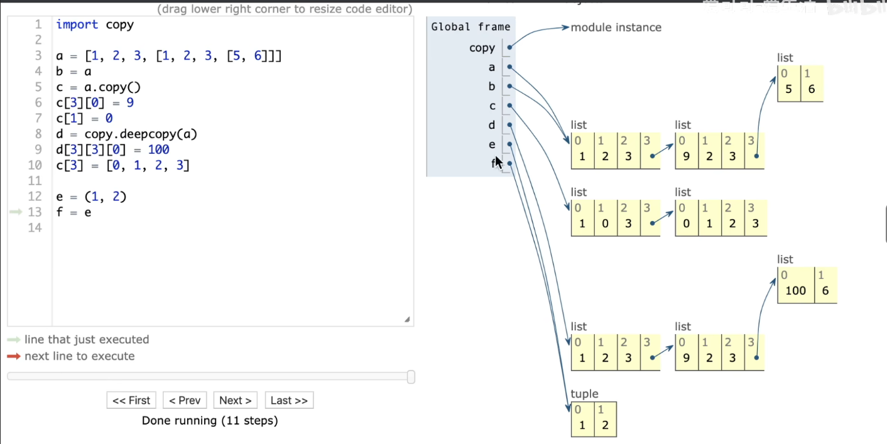

python常用库及函数

<!-- more -->

## 模块

### decimal 高精度

[【python】Decimal的使用](https://blog.csdn.net/qq_39147299/article/details/124200896)

用于浮点数和较大的数据进行运算。

#### 1.精度

decimal的精度默认是28位，可以自定义，通过getcontext获取线程上下文，然后修改prec属性即可

prec代表有效数字

```python
from decimal import Decimal, getcontext

print(getcontext().prec)  # 计算精度，默认是28  
getcontext().prec = 100  # 可修改
```

```python
# from decimal import Decimal,Context,setcontext
from decimal import *
setcontext(Context(prec=10000000,Emax=3000000,Emin=0))   #有效数字，最大指数，最小指数
```

#### 2.Decimal

通过实例化Decimal对象时传入value参数把其他的数据类型转换成Decimal类型。注意，尽量传入整数和字符串，如果传入float会导致结果不准确（float本身就存在精度问题）

```python
a = Decimal("5632569878.6514126")  # 字符串
c = Decimal(63)  # 整数
d = Decimal.from_float(6.325)  # Decimal(6.32500000000000017763568394002504646778106689453125), 不准确
```

Decimal类型也可以像python基本数据类型那样进行加减乘除等运算，运算完后还是Decimal类型。

```python
a = Decimal("8.651")  # Decimal(8.651)
b = Decimal("7")  # Decimal(7)

print(a // b)  # Decimal(1)
print(a ** 2)  # Decimal(74.839801)
```

### datetime 日期时间

#### datetime()

```python
import datetime

# date(年, 月, 日)
a = datetime.date(2019, 11, 28)
print(a)

# datetime(年, 月, 日, 时间, 分钟, 秒, 微秒)
# 最后一位可以不写
d = datetime.datetime(2000, 1, 1, 12, 30, 59, 600)
print(d)
# 2000-01-01 12:30:59.000600

d = datetime.datetime(2000, 1, 1, 12, 30, 59)
print(d)
# 2000-01-01 12:30:59
```

- `year`：年份
- `month`：月份
- `day`：日期
- `hour`：小时
- `minute`：分钟
- `second`：秒
- `microsecond`：微秒

```python
# 可以用以上的参数提取datetime的相关属性
>>> d = datetime.datetime(2000, 1, 1, 12, 30, 59)
>>> print(d.year)
2000

# 获取星期几(0~6)
>>> print(d.weekday())
```

#### 时间移动

`datetime.timedelta()` 可以接受以下参数：

- `days`（天数）
- `seconds`（秒数）
- `microseconds`（微秒数）
- `milliseconds`（毫秒数，已废弃，不推荐使用）
- `minutes`（分钟数）
- `hours`（小时数）
- `weeks`（周数）

```python
import datetime 
# datetime() + timedelta() = datetime()

# timedelta() +- timedelta() = timedelta()
# timedelta() */ int = timedelta()
# timedelta() % timedelta() = timedelta()

datetime.timedelta(days=1)
```

#### datetime() 和 string 转换

- `%Y`：四位年份（如 2024）
- `%m`：两位月份（01 到 12）
- `%d`：两位日期（01 到 31）
- `%H`：两位小时（24 小时制，00 到 23）
- `%M`：两位分钟（00 到 59）
- `%S`：两位秒数（00 到 59）
- `%f`：微秒（六位数字，如 123456）
- `%a`：星期几的简写（如 Mon）
- `%A`：星期几的全称（如 Monday）
- `%p`：AM/PM（12 小时制）

##### datetime() 转字符串

```python
from datetime import datetime

dt = datetime(2024, 10, 10, 12, 30, 45)

dt_str = dt.strftime("%Y-%m-%d %H:%M:%S")
print(dt_str)  # 输出：2024-10-10 12:30:45
```

##### 字符串转 datetime()

```python
from datetime import datetime

# 字符串
dt_str = "2024-10-10 12:30:45"

# 转换为 datetime 对象
dt = datetime.strptime(dt_str, "%Y-%m-%d %H:%M:%S")
print(dt)  # 输出：2024-10-10 12:30:45
```

### sys

`sys.stdin.read()` 的使用是用来从标准输入（stdin）读取所有的数据，直到输入结束（EOF，即文件结束符）

```python
import sys
input = sys.stdin.read
```

```python
# 如果是n，m，则date[i*2+0]，date[i*2+1]
n=int(date[0])
for i in range(n):
    a=int(date[i*2+1])
    b=int(date[i*2+2])
```

### copy



```python
a = [1, 2, 3]
b = a.copy()   # python内置函数

import copy

b = copy.copy(a)
b = copy.deepcopy(a)
```

### queue 队列

#### Queue 先进先出

https://www.cnblogs.com/lincappu/p/12890761.html

先进先出队列，最早进入队列的数据拥有出队列的优先权

```python
import queue
q = queue.Queue()

q.put(x)    # 插入元素。
q.get()     # 取出队首元素并将其从队列中移除
q.qsize()   # 返回队列的当前大小。
q.empty()   # 判断队列是否为空。
```

#### LifoQueue 后进先出

后进先出队列，最晚进入队列的数据拥有出队列的优先权，可以看作栈

```python
import queue
q = queue.LifoQueue()

q.put(x)    # 插入元素。
q.get()     # 取出顶部元素并将其从队列中移除
q.qsize()   # 返回队列的当前大小。
q.empty()   # 判断队列是否为空。
```

#### PriorityQueue 优先队列

https://blog.csdn.net/u013288190/article/details/128810536

默认小根堆，需要大根堆时将元素值取负

```python
import queue
pq = queue.PriorityQueue()
# from queue import PriorityQueue
# pq = PriorityQueue()

pq.put(x)     # 插入元素
pq.get()      # 取队首元素的值并将其弹出
pq.qsize()    # 队列大小
pq.empty()    # 判断是否为空
```

## 函数

### sort 排序

https://blog.csdn.net/memory_qianxiao/article/details/80548203

```python
a = sorted(iterable[, cmp[, key[, reverse]]])   # 保留原列表

iterable.sort(cmp[, key[, reverse]])   # 不保留原列表
```

如果想自定义比较函数，可以用 `functools.cmp_to_key` ，必须返回1，-1，0

```python
import functools


def com(x, y):
    if x > y:
        return -1  # -1类似于c++  return x > y
    elif x < y:
        return 1
    else:
        return 0

# 简写
def com(x, y):
    if x > y:
        return -1  # 右边
    else:
        return 1


a = [5, 4, 3, 1, 2]
a.sort(key=functools.cmp_to_key(com))
print(a)

```

### bisect（二分）

https://www.cnblogs.com/hider/p/14711550.html

## isinstance()

`isinstance()` 是 Python 的内置函数，用于检查一个对象是否是指定类型的实例。它的语法如下：

Python复制

```python
isinstance(object, classinfo)
```

**参数说明**

- **`object`**：要检查的对象。
- **`classinfo`**：可以是一个类型（如 `int`、`str`、`list` 等），也可以是一个元组，包含多个类型。如果 `object` 是 `classinfo` 中任意一个类型的实例，`isinstance()` 将返回 `True`。
